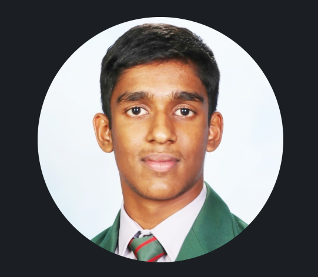

### Hey! Welcome to my Blog!

My name is Aswin Jacob Lijo (46444022) and I am 4th Year Bachelor of Engineering (Honours) Student at The University of Queensland. I have really enjoyed the ELEC4630 course so far, it has given me so much COOL knowledge  in the field of Image Processing and I look forward to venturing into the Deep Learning aspects. Through this blog I want to document my learning on FastAI, and recount my journey into Assignment 2. 

So, Welcome to my Blog!

